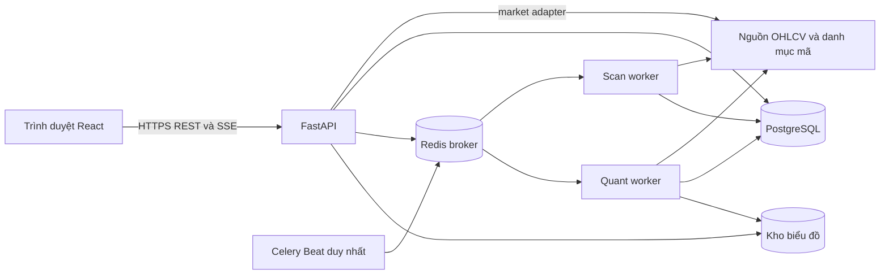
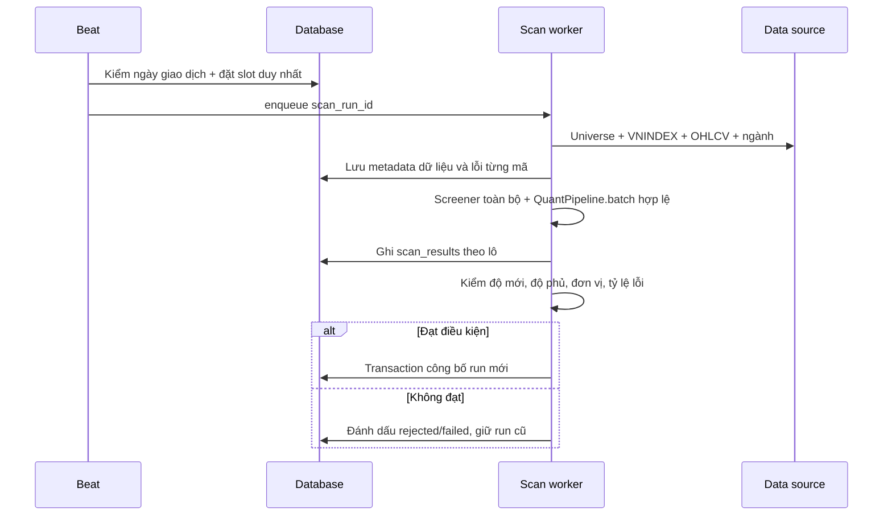

# QuanTik — Thiết kế hệ thống

**Phiên bản:** 1.0 · **Ngày:** 2026-09-22 · **Trạng thái:** Thiết kế đề xuất  
**Yêu cầu nguồn:** [SRS](SRS.md)

## 1. Quyết định kiến trúc

| ID | Quyết định | Lý do |
|---|---|---|
| AD-01 | React SPA + FastAPI + worker Python dùng chung package `backend/quant_engine/`, được sao chép từ `quant-core/`. `quant-core/` giữ nguyên làm tham chiếu. | Bảo vệ source phân tích gốc đã kiểm chứng trong khi tách xử lý dài khỏi HTTP. |
| AD-02 | PostgreSQL là nguồn sự thật cho run, kết quả, job, quyền và metadata; Redis chỉ làm broker/cache ngắn hạn. | Xem lại kết quả sau khi restart; không phụ thuộc state RAM. |
| AD-03 | Celery + Redis chạy queue; một Celery Beat riêng tạo lịch; job QUANT và scan dùng queue/tài nguyên riêng. | HMM/GARCH/LightGBM nặng CPU, cần kiểm soát song song và ưu tiên. |
| AD-04 | Trang chủ dùng bảng điện React tự dựng và Lightweight Charts; API backend cấp snapshot giá từ nguồn được phép sử dụng. | Hiển thị được cả HOSE/HNX/UPCoM mà không phụ thuộc độ phủ widget; feed thực tế cần được chốt trước production. |
| AD-05 | `GET` cho snapshot trạng thái job và SSE cho tiến độ. | Tiến độ chỉ đi server → client; trang tải lại vẫn đọc được từ DB. |
| AD-06 | Kết quả scan được công bố nguyên đợt bằng con trỏ `published_run_id`. | Người dùng không thấy dữ liệu của run đang dở hoặc hỗn hợp hai run. |
| AD-07 | Dữ liệu nghiệp vụ có trường kiểu rõ để lọc/sắp xếp, payload QUANT đầy đủ trong JSONB có version. | API danh sách nhanh, chi tiết giữ được mô hình đang phát triển. |

Các mô hình và chức năng trong `quant-core/` là **baseline đã được kiểm chứng** theo yêu cầu dự án. Regression trong thiết kế này xác nhận bản sao/integration giữ nguyên hành vi trên cùng input; benchmark đo tải khi chuyển sang dịch vụ toàn sàn. Hai hoạt động đó không phải quá trình đánh giá lại tính khả thi của thuật toán gốc.

Theo số liệu vận hành do chủ dự án cung cấp, một lượt phân tích toàn sàn chạy thủ công mất **khoảng 1 giờ**. Scheduler, timeout, tiến độ và bố trí worker phải lấy đây làm baseline ban đầu, sau đó đo lại khi chạy bằng bản sao trong container và ghi `duration_seconds` theo từng run.

## 2. Kiến trúc tổng thể



**Triển khai ban đầu:** một máy/VM Linux hoặc Docker Compose với `web`, `api`, `scan-worker`, `quant-worker`, `beat`, `postgres`, `redis`, kho file có volume bền vững. Khi cần nhiều máy, kho biểu đồ chuyển sang S3-compatible object storage. Phát triển trên Windows dùng Docker/WSL cho Celery và Redis; không phụ thuộc `ThreadPoolExecutor` trong API.

### 2.1 Thành phần và trách nhiệm

| Thành phần | Trách nhiệm | Không chịu trách nhiệm |
|---|---|---|
| React web | Điều hướng, bộ lọc kết quả, bảng điện, biểu đồ chi tiết và báo cáo, subscribe SSE. | Tính điểm, giữ API secret nguồn dữ liệu. |
| FastAPI | Xác thực/phân quyền, validate input, truy vấn DB, tạo job, stream tiến độ, cấp URL biểu đồ. | Tính mô hình trực tiếp trong request. |
| Scan scheduler | Tạo slot `PRE_OPEN`/`POST_CLOSE` vào ngày giao dịch; kiểm tra duy nhất. | Tải hàng nghìn mã trong tiến trình scheduler. |
| Scan worker | Chốt universe, fetch/canonicalize dữ liệu, screener, batch QUANT, kiểm chất lượng và công bố. | Cập nhật giá bảng điện. |
| Quant worker | Phân tích một mã theo bối cảnh được chốt, kiểm định lịch sử tùy chọn, tạo chart, ghi job/report. | Đổi kết quả scan đã công bố. |
| PostgreSQL | Lưu run, kết quả, quyền, báo cáo metadata và audit. | Là broker hàng đợi hoặc kho ảnh lớn. |
| Redis | Vận chuyển task và phát sự kiện tiến độ ngắn hạn qua pub/sub, giới hạn tốc độ. | Lưu báo cáo dài hạn duy nhất. |
| Kho biểu đồ | PNG/SVG/PDF được phép theo cấu hình, theo `job_id` và manifest. | Giữ dữ liệu truy vấn bảng summary. |

## 3. Bảo toàn source gốc và tích hợp bản sao

### 3.1 Quy tắc sao chép

1. **Không chỉnh sửa `quant-core/`.** Kể cả đổi import, thêm type hint, format code, sửa bug, đổi tên hoặc chuyển file đều phải thực hiện ở bản sao.
2. Trước thay đổi đầu tiên, tạo `backend/quant_engine/` và sao chép các file cần dùng (`crawl_data.py`, `quant.py`, `quant_visuals.py`, `backtest.py`) vào đó. Thêm `__init__.py`, adapter và service mới **chỉ trong bản sao/package mới**. Không dùng symlink hoặc import path trỏ ngược về `quant-core/` ở production.
3. Ghi manifest tên file, kích thước, SHA-256 của file nguồn và file bản sao ngay sau khi sao chép; lưu manifest trong repo. Vì `quant-core/` hiện là thư mục chưa được Git theo dõi ở checkout này, checksum manifest đặc biệt quan trọng để xác nhận nguyên trạng; cần đưa bản gốc vào quản lý phiên bản hoặc lưu snapshot an toàn trước khi triển khai.
4. CI so SHA-256 `quant-core/` với manifest baseline và thất bại nếu bản tham chiếu thay đổi ngoài một quy trình nâng baseline riêng. Mọi thay đổi trong `backend/quant_engine/` đi qua review, có changelog ngắn và regression fixture.
5. Khi phát hiện bug ở source gốc, ghi issue và sửa trong bản sao trước. Chỉ cập nhật `quant-core/` nếu có yêu cầu riêng của chủ dự án để nâng baseline; không tự đồng bộ ngược.

```text
quant-core/                  # tham chiếu gốc, giữ nguyên
  crawl_data.py
  quant.py
  quant_visuals.py
  backtest.py
backend/
  quant_engine/             # bản sao được phép tích hợp/refactor
    __init__.py
    crawl_data.py
    quant.py
    quant_visuals.py
    backtest.py
    adapters/
    services/
  app/                      # API, DB, queue, scheduler
docs/
  quant-core-baseline.sha256 # tạo ở bước triển khai sau khi sao chép
```

### 3.2 Bản đồ thay đổi trên bản sao

| Source tham chiếu (không sửa) | Tình trạng | Thay đổi dự kiến **trên `backend/quant_engine/`** |
|---|---|---|
| `quant-core/crawl_data.py` | CLI `StockScreener.scan()` fetch từng mã, loại mã ít dữ liệu/thanh khoản và chỉ trả top 70. | Tách `DataProvider`, `FeatureEngine`, `ScreeningEngine`, `MarketAnalyzer` thành hàm thuần/service. Trả **mọi mã** với status/reasons; tránh fetch OHLCV lặp. Tin tức là enrichment tùy chọn, lỗi tin không chặn scan. |
| `quant-core/quant.py` | `QuantPipeline.batch()` có cross-sectional LightGBM và adaptive score; `run_pipeline()` gắn Excel/Google Sheets/Parquet. | Gọi `batch()` trực tiếp trên tập OHLCV chuẩn và screener result; đưa export file ra adapter tùy chọn; không đổi logic điểm khi chưa có regression fixture. |
| `quant-core/quant_visuals.py` | `generate_quant_visuals()` có thể tự fetch và tự phân tích. | Trong job luôn truyền report + price data đã chốt để biểu đồ khớp cùng kết quả; ghi manifest cho từng ảnh. |
| `quant-core/backtest.py` | Đọc Excel khuyến nghị lịch sử, có một số hằng số cố định và fetch riêng. | Tách core kiểm định nhận danh sách recommendation và OHLCV đã lưu theo `as_of`; chạy riêng trong job, xuất chỉ số có sample size và giai đoạn kiểm định. |
| `backend/server.py` | Job nằm trong `JOBS` RAM, dùng `ThreadPoolExecutor`. | Chuyển API router, service, repository, Celery tasks; trạng thái trong DB. |
| `backend/adapters.py` | Board, module và summary đều là demo. | Loại khỏi production; chỉ dùng fixture kiểm thử nếu cần. |
| `src/App.jsx` và modal | Một trang, popup, mock board. | Các route `/`, `/scan`, `/stocks/:symbol`, `/quant/jobs/:id`, `/quant/reports`, `/admin`. |

### 3.3 Quy tắc tích hợp pipeline

1. **Một lần lấy dữ liệu cho một run:** tải universe, VN-Index, exchange map, ngành và OHLCV; chuẩn hóa `close/high/low/open` sang VND ngay ở boundary. Lưu `source`, `received_at`, `data_as_of`, số bars.
2. **Screener mọi mã:** tính 21 tiêu chí và tín hiệu; mã bị loại bởi thanh khoản/thiếu lịch sử vẫn tạo row status. `StockScreener.scan()` hiện trả top 70 nên không dùng output đó như toàn bộ universe.
3. **Batch QUANT:** chạy trên các mã đủ điều kiện về dữ liệu. `QuantPipeline.batch()` cần nguyên tập để chấm z-score/cross-sectional model. Bản summary đã có phần lớn 10 trường yêu cầu.
4. **Giữ lỗi có cấu trúc:** exception của từng mã, từng nguồn hoặc từng chart được ghi; một mã lỗi không làm mất toàn bộ đợt nếu các ngưỡng công bố còn đạt.
5. **Không thay đổi thầm điểm:** fixture trên **cùng dữ liệu, cấu hình và universe** so sánh output của `quant-core/` gốc với `backend/quant_engine/`: `Action`, `Score`, `GatePass`, `GateReasons`, `HoldPlan`, ngành và VNI. Lưu diff và giải thích mọi thay đổi có chủ đích. Mở rộng universe là thay đổi đầu vào của chấm điểm cross-sectional, nên đánh giá tác động riêng.
6. **Job một mã:** ưu tiên dùng snapshot tập tham chiếu của run gần nhất với `data_as_of` tương ứng. Muốn điểm so sánh được, phải lưu artifact mô hình cross-sectional, phân phối factor/z-score và version từ run, hoặc chạy lại batch cùng tập tham chiếu. Nếu không có các artifact đó, trả `score_comparable=false`, giải thích lý do; không gán điểm batch giả.

## 4. Lịch quét và công bố

### 4.1 Slot

- **`PRE_OPEN`**: chạy trước phiên, dùng **ngày giao dịch đã hoàn tất gần nhất**. Kết quả này hữu ích để chuẩn bị trước phiên, không phải phân tích giá đang giao dịch.
- **`POST_CLOSE`**: chạy khi provider đã trả dữ liệu ngày đầy đủ và qua ngưỡng cutoff hiện tại của `quant.py` (16:00 VN); worker kiểm tra nến cuối cùng và thử lại có giới hạn nếu chưa sẵn sàng.
- Giờ kích hoạt là cấu hình `SCAN_PRE_OPEN_TIME`, `SCAN_POST_CLOSE_TIME`, timezone `Asia/Ho_Chi_Minh`. Vì run thủ công mất khoảng 1 giờ, `PRE_OPEN` phải bắt đầu **ít nhất 1 giờ cộng biên dự phòng trước mốc cần công bố**. `POST_CLOSE` chỉ bắt đầu sau khi dữ liệu ngày đủ điều kiện (hiện `quant.py` dùng cutoff 16:00 VN), rồi dự kiến cần thêm khoảng 1 giờ để hoàn tất. Không dùng một giờ khởi chạy mẫu cố định khi chưa chốt mốc công bố mong muốn.
- Lịch ngày giao dịch lấy từ nguồn lịch có kiểm chứng, lưu cache và có khả năng override bằng admin cho ngày nghỉ bất thường. Weekend guard chỉ là lớp phụ.

### 4.2 State machine và công bố

`scheduled → collecting → screening → quantifying → validating → published` hoặc `failed/rejected`.

Khóa duy nhất `(trading_date, slot, attempt)` và khóa logic `(trading_date, slot, active)` ngăn hai worker xử lý cùng một đợt. Scheduler duy nhất; DB advisory lock hoặc hàng trạng thái có compare-and-swap bảo vệ khi retry. Manual rerun tạo `attempt` mới; không sửa run cũ.

Trong bước `validating`: so số mã với universe, kiểm độ mới OHLCV/VNI, số mã đạt dữ liệu, tỷ lệ lỗi, sự thống nhất đơn vị và thời gian. Ngưỡng `MIN_COVERAGE_PCT`, `MAX_FAILED_PCT`, `MAX_DATA_AGE` là cấu hình, được đo bằng chạy thử; không hardcode con số thiếu căn cứ. Sau khi pass, transaction cập nhật `published_run_id`. Run cũ vẫn xem được cho admin.

API luôn trả run đã công bố gần nhất trong khoảng ~1 giờ run mới đang chạy. Scan và job người dùng dùng queue/worker riêng; thời gian chờ của job QUANT được báo rõ nếu tài nguyên hữu hạn. Watchdog/timeout của scan đặt cao hơn baseline 1 giờ và điều chỉnh theo số đo production, không dùng timeout HTTP cho tác vụ này.

## 5. Thiết kế dữ liệu

### 5.1 Bảng chính

| Bảng | Cột/khóa chính | Chỉ mục/ràng buộc |
|---|---|---|
| `users` | `id`, `email`, `password_hash` hoặc `external_subject`, `role`, `created_at`, `disabled_at` | unique email; role `user/admin`. |
| `symbols` | `symbol`, `exchange`, `name`, `sector_code`, `active`, `updated_at` | `(exchange, active)`, unique symbol theo quy tắc canonical. |
| `scan_runs` | `id`, `trading_date`, `slot`, `attempt`, `status`, `data_as_of`, `started_at`, `finished_at`, `published_at`, `model_version`, `config_hash`, `universe_count`, `analyzed_count`, `failed_count`, `error_summary`, `triggered_by` | unique `(trading_date, slot, attempt)`, `(status, published_at desc)`. |
| `scan_results` | `id`, `run_id`, `symbol`, `exchange`, `analysis_status`, 10 trường summary chuẩn, `reason_codes`, `screener_payload JSONB`, `quant_payload JSONB`, `data_quality JSONB`, `source_meta JSONB`, `error_code` | unique `(run_id, symbol)`, `(run_id, score desc)`, `(run_id, exchange)`, `(run_id, recommendation)`, `(run_id, sector)`. |
| `publication_state` | `key='latest'`, `published_run_id`, `updated_at` | một hàng, FK tới `scan_runs`; đổi trong transaction. |
| `quant_jobs` | `id`, `user_id`, `symbol`, `status`, `phase`, `progress_pct`, `idempotency_key`, `reference_run_id`, `requested_at`, `started_at`, `finished_at`, `error_code`, `error_message`, `attempt` | `(user_id, requested_at desc)`, `(symbol, requested_at desc)`, unique `(user_id, idempotency_key)` khi key có giá trị. |
| `job_events` | `id`, `job_id`, `sequence`, `event_type`, `progress_pct`, `message`, `created_at` | unique `(job_id, sequence)`; phục vụ SSE reconnect và audit tiến độ, retention ngắn hơn báo cáo. |
| `quant_reports` | `id`, `job_id`, `user_id`, `symbol`, `data_as_of`, `model_version`, `score_comparable`, `report_payload JSONB`, `backtest_payload JSONB`, `created_at` | unique job, `(user_id, created_at desc)`, `(symbol, created_at desc)`. |
| `report_artifacts` | `id`, `report_id`, `kind`, `format`, `storage_key`, `bytes`, `sha256`, `status`, `error_message` | unique `(report_id, kind, format)`; chỉ trả signed URL hoặc route kiểm quyền. |
| `audit_events` | `id`, `actor_id`, `action`, `object_type`, `object_id`, `occurred_at`, `details JSONB` | `(occurred_at desc)`, `(actor_id, occurred_at desc)`. |

Giá nội bộ là VND, lưu số nguyên hoặc `NUMERIC` phù hợp; tỷ lệ có hậu tố `_pct` là phần trăm (ví dụ `2.5` nghĩa là 2,5%). `null` thể hiện không tính được; 0 chỉ khi thực sự bằng 0. JSONB có `schema_version`; migration không cần đồng loạt biến đổi payload cũ khi thêm metric mới.

### 5.2 Dữ liệu tạm và lưu trữ

OHLCV của từng run có thể cache tại object storage theo `source/trading_date/run_id/symbol`, kèm hash và metadata để đối chiếu kết quả; thời gian giữ theo dung lượng thực tế. Báo cáo số và metadata sống trong PostgreSQL. Biểu đồ ghi vào `reports/{job_id}/{kind}.{ext}` và manifest DB; API không expose path hệ thống. Redis không giữ payload DataFrame hoặc ảnh lớn, chỉ task ID/sự kiện nhỏ.

## 6. API contract v1

API có tiền tố `/api/v1`; OpenAPI/Pydantic là hợp đồng được sinh từ code. Các trường JSON dùng `snake_case`, giờ ISO 8601 UTC, trang mặc định 50 dòng và giới hạn trang tối đa cấu hình.

| Method + path | Quyền | Chức năng |
|---|---|---|
| `GET /health/live`, `GET /health/ready` | Hạ tầng | Liveness và readiness (DB/broker theo mức cần thiết). |
| `POST /api/v1/auth/register`, `POST /api/v1/auth/login`, `POST /api/v1/auth/logout`, `GET /api/v1/auth/me` | Theo thao tác | Đăng ký/đăng nhập nội bộ nếu chọn phương án này; admin tạo qua seed/CLI. |
| `GET /api/v1/scans/latest` | Công khai | Metadata run đã công bố, `data_as_of`, độ phủ và trạng thái. |
| `GET /api/v1/market/overview` | Công khai | Snapshot bảng điện: chỉ số, breadth, danh sách mã/giá/biến động/khối lượng, `source`, `as_of`, `delay_minutes`, `market_status`. Danh sách nhận `page`, `page_size` (5/10/20), trả `total`; cache ngắn theo giấy phép và độ mới của feed. |
| `GET /api/v1/scans/latest/results` | Công khai | 10 trường summary; query `q`, `exchange`, `recommendation`, `gate_pass`, `sector`, `score_min/max`, `sort`, `page`, `page_size`. |
| `GET /api/v1/scans/latest/results/{symbol}` | Công khai | Chi tiết kết quả của run mới nhất, gồm status/lỗi/metadata. |
| `GET /api/v1/scans/latest/results/{symbol}/ohlcv` | Công khai | Dữ liệu nến/khối lượng của cùng run đã công bố; query `limit` tối đa 260 phiên. |
| `GET /api/v1/scans/{run_id}/results` | Admin (hoặc quyền lịch sử được cấp sau) | Xem run cũ. |
| `GET /api/v1/scans/{run_id}/results/{symbol}` | Admin | Chi tiết run cũ. |
| `POST /api/v1/quant/jobs` | User | Tạo job, trả `202` + `job_id`; header `Idempotency-Key`. |
| `GET /api/v1/quant/jobs/{job_id}` | Chủ job/admin | Snapshot trạng thái và `report_id` khi thành công. |
| `DELETE /api/v1/quant/jobs/{job_id}` | Chủ job/admin | Yêu cầu hủy khi queued hoặc tại checkpoint có hỗ trợ hủy. |
| `GET /api/v1/quant/jobs/{job_id}/events` | Chủ job/admin | SSE `job.progress`, `job.succeeded`, `job.failed`, heartbeat. |
| `GET /api/v1/quant/reports` | User/admin | Lịch sử báo cáo của mình; lọc `symbol`. |
| `GET /api/v1/quant/reports/{report_id}` | Chủ báo cáo/admin | Báo cáo JSON và manifest ảnh. |
| `GET /api/v1/quant/reports/{report_id}/artifacts/{artifact_id}` | Chủ báo cáo/admin | Ảnh qua route kiểm quyền hoặc signed URL. |
| `GET /api/v1/admin/scan-runs`, `POST /api/v1/admin/scan-runs` | Admin | Theo dõi và tạo manual run. |
| `GET /api/v1/admin/jobs` | Admin | Tình trạng queue, lỗi và lịch sử. |

**Ví dụ summary:**

```json
{
  "run_id": "2b3b2a76-7df1-4d8a-b378-0a7bdd99b94e",
  "data_as_of": "2026-09-21T09:00:00Z",
  "total": 1,
  "page": 1,
  "items": [{
    "symbol": "FPT", "recommendation": "THEO DÕI", "gate_pass": false,
    "gate_explanation": "Chờ xác nhận thời điểm vào lệnh", "score": 67.4,
    "rating": "MUA LƯỚT SÓNG", "hold_plan": "10 phiên",
    "vni_trend": "TRUNG TÍNH", "sector": "Công nghệ", "sector_trend": "TĂNG"
  }]
}
```

Giá trị ví dụ minh họa schema, không phải khuyến nghị thực. Chi tiết có thêm `analysis_status`, `as_of`, `screener`, `models`, `risk`, `commentary`, `warnings`, `source_meta`, `model_version`. Khi chưa có run, `GET latest` trả `404` với mã `NO_PUBLISHED_SCAN`; UI có empty state.

**OHLCV cho biểu đồ:** response gồm `symbol`, `exchange`, `run_id`, `data_as_of`, `adjustment` (`raw` hoặc `adjusted`), `price_unit`, `volume_unit`, `source_meta` và `bars` tăng dần theo ngày; mỗi bar có `time` (`YYYY-MM-DD`), `open`, `high`, `low`, `close`, `volume`. Backend kiểm tra `low <= open/close <= high`, giá và khối lượng không âm, loại bỏ phiên trùng, đánh dấu khoảng trống dữ liệu. Lấy từ snapshot đã chốt của run và cache HTTP theo `run_id`; không lấy dữ liệu giá qua widget hoặc scrape TradingView. Nếu chưa có OHLCV được phép phân phối, API trả lỗi có cấu trúc và UI hiện trạng thái thiếu dữ liệu.

**Yêu cầu job:** `POST /api/v1/quant/jobs` nhận `{ "symbol": "FPT", "include_backtest": true }`. Bản đầu chạy toàn bộ module QUANT; không cho client bỏ qua các gate rủi ro bằng danh sách module tùy chọn. Response `202` trả `{ "job_id": "...", "status": "queued", "status_url": "/api/v1/quant/jobs/..." }`. GET job trả thêm `phase`, `progress_pct`, `requested_at`, `started_at`, `finished_at`, `report_id` và lỗi nếu có. Báo cáo trả `summary`, `screener`, `models`, `forecast`, `risk`, `backtest`, `chart_manifest`, `data_as_of`, `reference_run_id`, `score_comparable`. SSE gửi cùng `job_id` và trạng thái, không chứa payload báo cáo lớn.

**Lỗi chuẩn:** `{ "code": "...", "message": "...", "request_id": "...", "details": {} }`. `401` chưa đăng nhập, `403` không đủ quyền, `404` không thấy/không được phép thấy tài nguyên, `409` xung đột idempotency, `429` vượt hạn mức job, `503` broker/source chưa sẵn sàng.

## 7. Luồng xử lý chi tiết

### 7.1 Scan toàn sàn



Fetch theo lô và giới hạn đồng thời theo chính sách nguồn; không đặt một request/mã vào hàng đợi riêng nếu mô hình cuối cần toàn bộ tập. Có thể chia pha fetch nhiều shard, sau đó fan-in một pha batch model. Ghi checkpoint sau fetch/screener để retry không phải tải lại toàn sàn. Ưu tiên chạy scan qua queue riêng để job người dùng không làm trễ slot.

### 7.2 Job QUANT một mã

`POST` validate mã thuộc universe, user quota và idempotency → transaction tạo row `queued` → enqueue task → worker chốt `reference_run_id`/`data_as_of`, tải dữ liệu giá cần thiết → phân tích → kiểm định lịch sử nếu được yêu cầu và đủ dữ liệu → tạo biểu đồ → ghi report + artifact manifest → chuyển `succeeded`. Nếu enqueue thất bại, API chuyển job sang `failed` với `error_code=DISPATCH_FAILED` và trả lỗi tạm thời; watchdog hoặc thao tác retry có thể đẩy lại job. Mỗi pha ghi DB và `job_events`, sau đó publish sự kiện nhỏ vào Redis pub/sub; FastAPI đang giữ kết nối SSE chuyển tiếp ngay cho client. GET vẫn là nguồn sự thật. Nếu worker chết, watchdog đánh dấu job quá hạn để retry hoặc failed. Hủy chỉ cho phép khi queued hoặc tại checkpoint có thể hủy an toàn.

SSE gửi sự kiện nhỏ có `id` tăng dần; client reconnect với `Last-Event-ID` nếu log sự kiện còn lưu, hoặc đọc GET snapshot rồi subscribe lại. Luồng ổn định là **server push theo sự kiện**, không polling 0,7 giây như PoC. Nếu hạ tầng SSE không hỗ trợ, UI polling GET 2–5 giây như fallback. Không lưu toàn bộ log mô hình hoặc ảnh vào sự kiện. Bản sao `quant-core` cần callback/checkpoint ở ranh giới các bước đã có (fetch, kiểm dữ liệu, ARIMA, GARCH, HMM, alpha/scoring, risk, backtest, render). `progress_pct` là ước lượng theo bước đã xong; khi tác vụ đang chờ trong queue, hiển thị `queued` và thời gian chờ, không khẳng định vị trí hàng đợi chính xác nếu broker không cung cấp thứ tự đáng tin.

### 7.3 Kiểm định lịch sử

`backtest.py` được chuyển từ đọc Excel sang hàm nhận snapshot recommendation của các run cũ và OHLCV tương ứng. Mỗi tín hiệu dùng dữ liệu tại thời điểm phát hành; giá vào lệnh bắt đầu từ phiên sau theo quy tắc hiện có, chi phí và thời gian nắm giữ được ghi trong report. Với một mã không đủ nhiều tín hiệu lịch sử, ghi `backtest_status=insufficient_sample`; vẫn trả báo cáo phân tích. Hiệu suất quá khứ và dự báo hiện tại là hai khối riêng, kèm số mẫu và giai đoạn kiểm định.

## 8. Giao diện React

| Route | Khung nội dung |
|---|---|
| `/` | Header thương hiệu, giới thiệu ngắn, bảng điện phân trang và biểu đồ Lightweight Charts, nguồn/thời điểm dữ liệu, CTA lớn **QUÉT TOÀN SÀN**, trạng thái đợt mới nhất. Không sidebar lọc. |
| `/scan` | Header run (`slot`, `data_as_of`, độ phủ), thanh tìm kiếm và filter, bảng đúng 10 cột, phân trang. Click mã sang trang chi tiết. |
| `/stocks/:symbol` | Header mã + thời điểm run, biểu đồ nến/khối lượng Lightweight Charts từ OHLCV backend, khuyến nghị và reason, các card screener/QUANT/rủi ro/nguồn dữ liệu, CTA **Chạy phân tích QUANT**. |
| `/quant/jobs/:id` | Tiến độ theo pha; khi xong hiện báo cáo, biểu đồ và link lịch sử. Khi lỗi có thông báo và hành động chạy lại nếu hợp lệ. |
| `/quant/reports` | Danh sách báo cáo cá nhân, lọc mã/ngày/trạng thái; mở lại báo cáo. |
| `/admin` | Run monitor, độ phủ/lỗi, job monitor, manual trigger và audit. |

Giữ token màu từ `src/styles.css` (`--bg`, `--panel`, `--amber`, `--up`, `--down`), IBM Plex Sans/Mono và bố cục terminal. Thay modal bằng route để URL có thể chia sẻ. Bảng 10 cột cuộn ngang trên mobile, header/cột mã dễ nhận biết. Bảng điện và biểu đồ chi tiết tải độc lập. Backend cấp snapshot bảng điện có nguồn, thời điểm, độ trễ; OHLCV chi tiết có metadata sàn và thời điểm chốt. Nếu feed bảng điện hỗ trợ cập nhật trong phiên, client tải lại snapshot theo chu kỳ phù hợp với giới hạn nguồn; chỉ thêm push khi thực sự có feed và nhu cầu tương ứng.

## 9. Gói và dịch vụ đề xuất

Các dòng dưới đây là danh mục thành phần. Phiên bản runtime chính xác đã được khóa trong `backend/requirements.txt`; mọi thay đổi dependency phải chạy lại toàn bộ CI trước khi phát hành.

### 9.1 Backend Python

| Gói | Vai trò | Mức độ |
|---|---|---|
| `fastapi`, `uvicorn[standard]`, `pydantic` | HTTP API, validation, OpenAPI; FastAPI hiện hỗ trợ SSE trực tiếp. | Bắt buộc |
| `sqlalchemy`, `psycopg[binary]`, `alembic` | ORM/query, driver PostgreSQL, migration. | Bắt buộc |
| `celery[redis]`, `redis` | Queue CPU job, broker, tín hiệu tiến độ ngắn hạn; Celery Beat cho lịch. | Bắt buộc |
| `pydantic-settings` | Cấu hình và biến môi trường. | Bắt buộc |
| `PyJWT`, `pwdlib[argon2]` | Xác thực nội bộ nếu chưa có OIDC; cookie HttpOnly/Secure cho web. | Có điều kiện |
| `numpy`, `pandas`, `scipy`, `statsmodels`, `arch`, `hmmlearn`, `scikit-learn`, `lightgbm` | Các engine trong `quant.py`; kiểm thử và chốt phiên bản tương thích. | Bắt buộc theo module |
| `vnstock_data`, `vnstock` | `quant.py` đang gọi `vnstock_data`, còn `crawl_data.py`/`backtest.py` gọi `vnstock`. Chọn một adapter thống nhất sau khi kiểm tra quyền sử dụng, khả năng và giới hạn nguồn; chỉ cài gói thật sự cần. | Có điều kiện theo adapter |
| `matplotlib` | Render `quant_visuals.py` trong worker headless (`Agg`). | Bắt buộc |
| `openpyxl` | Chỉ còn cần cho import/migration Excel hoặc export tùy chọn. | Tùy chọn |
| `pytest`, `httpx` | Unit/API/integration tests. | Dev |

Không thêm `APScheduler` nếu đã dùng Celery Beat. Không dùng `fastapi.BackgroundTasks` hay `ThreadPoolExecutor` cho QUANT CPU job. Không dùng Celery result backend làm nơi giữ báo cáo dài hạn; PostgreSQL là nguồn sự thật.

### 9.2 Frontend và hạ tầng

| Thành phần | Vai trò |
|---|---|
| `react`, `react-dom`, `vite` | Giữ stack PoC hiện tại. |
| `react-router` | Route có URL riêng cho scan, mã, job, report. |
| `@tanstack/react-query` | Cache và trạng thái request, invalidation sau job/run mới; có thể bỏ nếu muốn ít gói và tự quản lý fetch. |
| `@playwright/test` | E2E các luồng chủ chốt; dùng thêm unit test frontend khi logic filter phức tạp. |
| PostgreSQL | Database chính, backup định kỳ. |
| Redis | Celery broker và pub/sub ngắn hạn, giới hạn quyền truy cập mạng. |
| Docker Compose | Môi trường local/staging và triển khai máy đơn ban đầu. |
| S3-compatible storage hoặc volume bền vững | Biểu đồ; chọn S3 khi tách nhiều máy. |
| Reverse proxy (Caddy/Nginx) | TLS, static assets, route API/SSE, timeout phù hợp. |
| `lightweight-charts` | Biểu đồ chỉ số trang chủ và biểu đồ nến/khối lượng trang chi tiết; backend cấp dữ liệu tương ứng. |

**Tham khảo tài liệu chính thức:** [Celery Redis](https://docs.celeryq.dev/en/latest/getting-started/backends-and-brokers/redis.html), [Celery Beat](https://docs.celeryq.dev/en/latest/userguide/periodic-tasks.html), [FastAPI SSE](https://fastapi.tiangolo.com/tutorial/server-sent-events/), [SQLAlchemy PostgreSQL](https://docs.sqlalchemy.org/en/20/dialects/postgresql.html), [Alembic](https://alembic.sqlalchemy.org/en/latest/tutorial.html), [React Router](https://reactrouter.com/start/declarative/routing), [Lightweight Charts](https://tradingview.github.io/lightweight-charts/).

## 10. Cấu hình, an toàn và vận hành

**Biến cấu hình chính:** `DATABASE_URL`, `REDIS_URL`, `OBJECT_STORAGE_*`, `APP_BASE_URL`, `CORS_ORIGINS`, `AUTH_*`, `SCAN_PRE_OPEN_TIME`, `SCAN_POST_CLOSE_TIME`, `MARKET_TIMEZONE`, `SCAN_MIN_COVERAGE_PCT`, `SCAN_MAX_FAILED_PCT`, `QUANT_MAX_CONCURRENT_PER_USER`, `QUANT_TIMEOUT_SEC`, `MARKET_DATA_SOURCE`. Secret không commit vào repo. Giới hạn CORS theo domain thật; chống CSRF nếu dùng cookie auth; không nhúng API secret vào React.

**Giám sát:** health API, heartbeat scheduler/worker, queue length, thời gian pha fetch/model/render, độ phủ run, độ mới dữ liệu, số job lỗi/timeout, dung lượng DB/storage. Cảnh báo khi POST_CLOSE chưa công bố sau ngưỡng vận hành hoặc run bị rejected; admin có manual rerun.

**Backup và retention:** backup PostgreSQL hằng ngày; biểu đồ có vòng đời và backup theo chính sách; run/báo cáo giữ theo cấu hình. Xóa báo cáo người dùng phải xóa/ẩn artifact đồng bộ, audit không giữ dữ liệu nhạy cảm quá mức. Thử phục hồi backup trước production.

## 11. Kiểm thử và phát hành

1. **Baseline và fixture:** kiểm SHA-256 của `quant-core/`; tập OHLCV cố định gồm đủ/thiếu dữ liệu, mất phiên, giá trần/sàn, thanh khoản thấp, đổi sàn, VN-Index thiếu; so output bản sao với bản gốc.
2. **Contract/API:** 10 cột và unit, pagination/filter/sort, 401/403/404/409/429, quyền người dùng/admin, JSON `null` đúng nghĩa.
3. **Scheduler:** ngày giao dịch/nghỉ, hai slot, retry, không tạo trùng, cutoff 16:00, run lỗi giữ bản công bố cũ.
4. **Queue:** restart API/worker, timeout, retry, double click, SSE reconnect, artifact lỗi một phần.
5. **E2E:** `/` → `/scan` → chi tiết → tạo job → xem báo cáo → tải lại → mở lịch sử; API bảng điện lỗi vẫn dùng được CTA.
6. **Load:** đo thời gian fetch toàn universe và batch model trên dữ liệu thật; điều chỉnh concurrency, ngưỡng công bố và hạ tầng theo số đo.

**Thứ tự triển khai:** (1) snapshot/checksum `quant-core/`, tạo bản sao `backend/quant_engine/` và fixture; (2) DB/migration + adapter chạy scan thủ công trên bản sao; (3) API kết quả; (4) queue QUANT + biểu đồ/kiểm định; (5) scheduler và công bố; (6) API thị trường và kết nối bảng điện React; (7) auth/admin, E2E, quan trắc, backup và thử tải. Mỗi giai đoạn có thể nghiệm thu bằng API/fixture trước khi nối UI. Không chỉnh sửa `quant-core/` ở bất kỳ giai đoạn nào.

Trước bước (2), ghi lại điều kiện của **lượt chạy thủ công ~1 giờ** (số mã, máy, nguồn dữ liệu), xác nhận quyền/quota của nguồn và chạy **một lượt toàn sàn trên worker** để đối chiếu thời gian. Thử tập 50/200/500 mã chỉ dùng khi cần khoanh vùng pha chậm. Xem [đánh giá khả thi và rủi ro](FEASIBILITY_RISK_ASSESSMENT.md).
